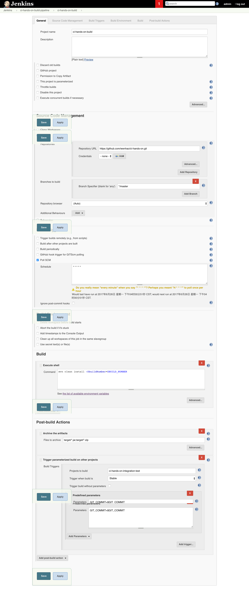
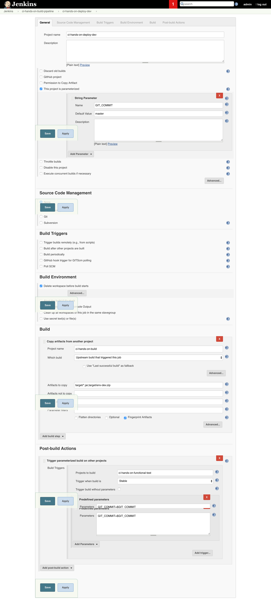
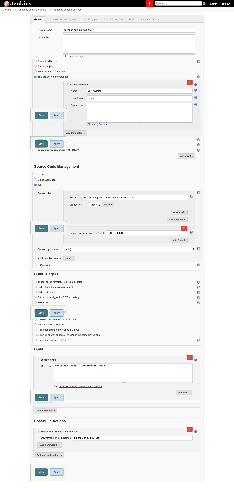
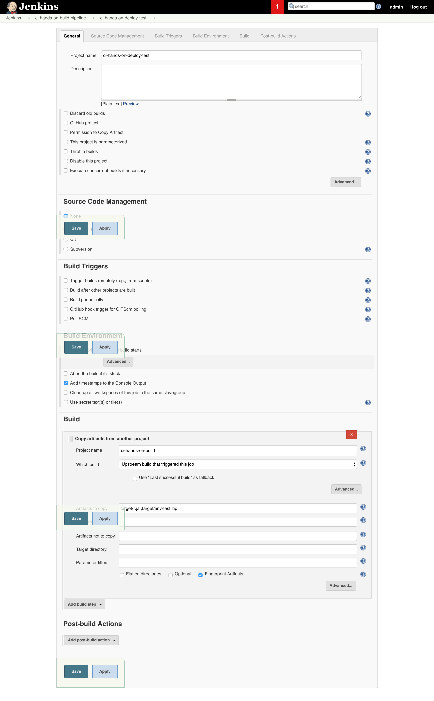

# ci-hands-on
Continuous Integration Practice

### 持续集成

此例子中集成测试与功能测试是单独运行的，这样做的目的只是为了演示如何在Jenkins上分阶段执行job。在实际的项目中，根据每种测试的执行时间尽可能的将测试的执行阶段前移，例如在构建阶段就运行集成测试和功能测试。

1. jacoco测试覆盖率的正确配置（配置需要测试覆盖的类）
2. 单元测试、集成测试分离（有多种方式：1. JUnit支持测试分类注解，2. 将集成测试放在integration或测试类以IntegrationTest结尾）
3. 环境配置分离
4. 创建jenkins构建的job
    * 拉取代码
    * 轮询构建
    * 测试覆盖率验证
    * 打包并供后续项目使用
5. 创建集成测试的jenkins job
    * 只跑集成测试
6. 开发环境部署使用jar包和正确的开发环境配置文件
7. 功能测试
8. 配置手动部署测试环境
9. 搭建部署流水线：build（构建）、integration-test（集成测试）、deploy-dev（部署-只准备部署的包不实际部署）、functional-test（功能测试）、deploy-test（手动部署）

### 注意事项

1. 在Intellij中运行程序需要先把envs/local设置Mark Directory as->Resources Root，如果运行还是报错，在local->remote.properties右键Recompile。
2. spring boot的外置配置文件可以通过--spring.config.location方式读取。
3. jenkins需要搭建在本地，需要提前下载jenkins: http://mirrors.jenkins.io/war-stable/latest/jenkins.war。
4. 安装jenkins：java -jar jenkins.war。确保所有的初始化插件都已安装成功。
5. 安装maven，确保在jenkins中能够执行mvn命令，并设置Java_HOME环境变量。
6. 安装jenkins插件：
    * Clone Workspace SCM Plug-in
    * Copy Artifact Plugin
    * Build Pipeline Plugin
    * JaCoCo plugin

### 步骤

1. 构建job
   
2. 集成测试job
   
3. 部署开发环境
   
4. 功能测试(如果时间比较短可入纳入构建job)
   
5. 部署测试环境
   
